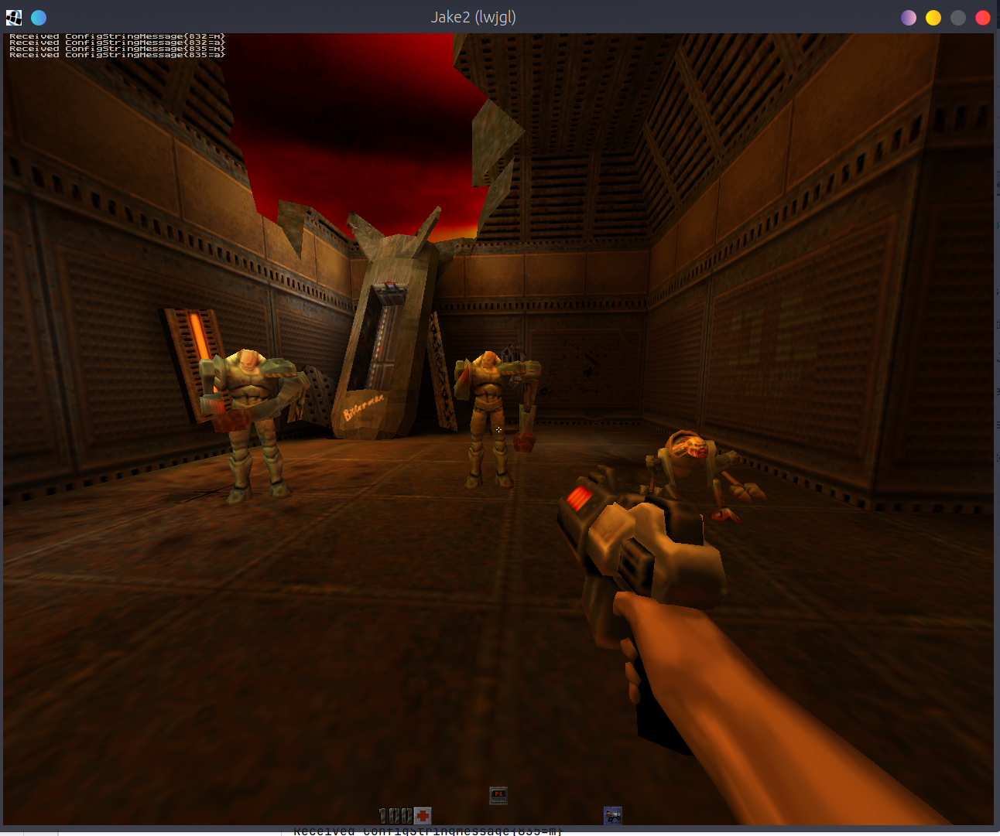

Jake2 README
============

[Screenshots](info/screenshots/Screenshots.md)

Jake2 is a port of the GPL'd Quake2 engine from id Software to Java. Jake2 is
distributed under the terms of the GPL (see LICENSE).

The port is implemented in Java, but some native libraries (LWJGL) are used for the
visual rendering, input processing and audio playback (OpenAL) functionality. 

Jake2 is still under development. Feel free to send bug report if you find one.

Currently, Jake2 supports every Java supported platform.

Requirements:

 * jdk version 11 to build and run Jake2

Please note that there is an issue with more recent java versions (17) on linux with lwjgl natives.

Documentation & Info
--------------------
 * [Overview](info/Overview.md)
 * [BSP file format](info/BSP.md)
 * [Networking](info/Networking.md)

What is Cake? Important note about client side code
---------------------------------------------------

Jake2 client in its vanilla form is archived in `jake2-legacy` branch and will not be maintained.
Even though one of the core ideas of this project was to reuse and improve (rather than reimplement from scratch) - 
the client side code was particularly hard to maintain and develop. 
Firstly, because it is written on top of the unmaintained and obsolete second LWJGL version,
which is incompatible with the current LWJGL version.
Secondly, jake2 rendering is implemented in OpenGL immediate mode and had to be rewritten on a modern shader pipeline anyway.
And lastly, there is a libGDX framework that can provide a lot of useful functionality, and ditch a lot of code (yes, `Menu.java`, I am looking at you)

The `client` and `fullgame` modules are excluded from the build. 
The new `cake` module is introduced for the client side part (WIP).

See [README.md](cake/README.md)

Installation and running
------------------------

build from source:
- `./gradlew build` - to build (and run tests) from source
- `./gradlew run` - to run cake client
- `./gradlew distZip` - to build the distribution

If you run jake from an IDE:
  1. to run the server run `Jake2Dedicated.main` with the desired args (`+set coop 1 +map base1`)
  2. to run the cake client run `Lwjgl3GameLauncher.main` and click `Multiplayer`

Installation of Quake2 data:
----------------------------

Jake can autodetect steam installation.
If it doesn't (when you have a non-steam version or when you install it to a custom location) pass basedir parameter to the game

`+set basedir "/home/demoth/.local/share/Steam/steamapps/common/Quake 2"`

If you want to have the latest experimental features you can grab the latest
Jake2 sources from GIT.

Compatibility
-------------

Jake2 is not compatible with the mods that have custom logic (game.dll).

Jake2 is network compatible with other clients, like Yamagi, Q2pro etc.

Jake2 is compatible with all map/models/sounds/textures as id Quake 2.

Goals of the project
--------------------

While Jake2 is a hobby project, it is important to keep at least high level goals in mind:

  1. Maintain the project runnable on modern machines and operating systems
  2. Bring the codebase up to contemporary expectations.
  3. Expand features of jake2 to bring more fun playing/modding it

At the moment of writing the goal N1 is achieved, and goal N2 is in progress.

Roadmap
-------

With accordance to the goals, we can put a list of more concrete steps:

  * gather game state in classes. at the moment state of the process is scattered across many static fields.
  * code cleanup - move to modern libraries (filesystem, network, logging)
  * file formats - support modern file formats (zip, image, audio, video, models?)
  * support "brother projets" content: q2 mission packs, q1? q3? hl?

### Crazy ideas area (proceed with caution):

  * add script support: graalvm support many scripting jvm languages, with little overhead. implement monster, items behavior with scripts
  * change 3d rendering code to something more recent (like yq2 gl3, q2xp?...)
  * implement mmo-like replayable campaign for q2:
 npc, quests, character progression, item & monster randomization, trading
  * jake2 game engine suit (unreal like):
full set of tools to support game development and creation of new games.
3d editor, entitity editor, scripting, and so on
  * procedural map generation
  * utilize kotlin multiplatform support and create jake2 clients for various platforms (desktop, web, android, ios)

3rd party components
--------------------

Jake2 uses:
lwjgl    Light Weight Java Game Library http://www.lwjgl.org
openal   Audio library                  http://www.openal.org

Use github issue tracker for bug reports and feedback.

have fun!

Authors
-------
Daniil Bubnov <bubnov.d.e@gmail.com> - current maintainer (2019+)

## bytonic Software
Developed the project in 2003 - 2015
 * Holger Zickner <hoz@bytonic.de>
 * Carsten Weiße <cwei@bytonic.de>
 * Rene Stoeckel  <rst@bytonic.de>

## Contributors

 * David Sanders - lwjgl support
 * Kenneth Russell	(Sun Microsystems) - jogl improvements
 * Scott Franzyshen	- 3rd Person Camera, CD Player emulation (MP3), Console Patch
