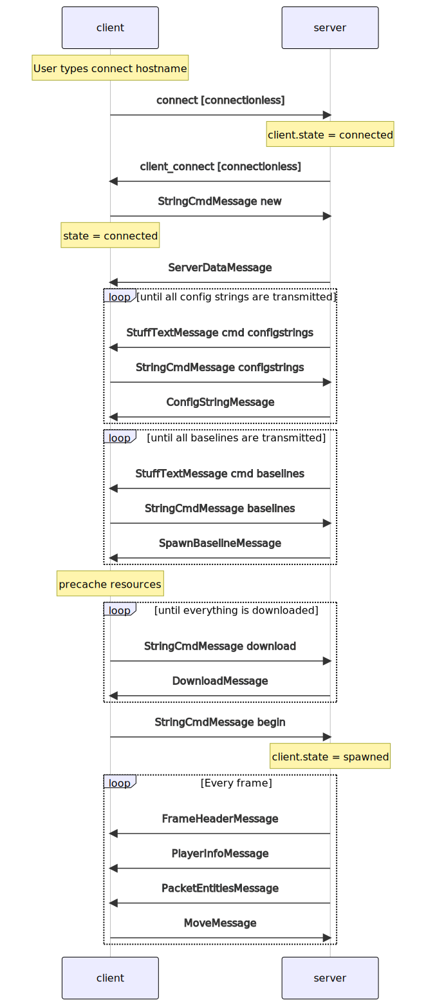

#Quake 2 Networking Communication Protocol

## NetworkPacket

Every frame both client and servers are sending a jake2.qcommon.network.messages.NetworkPacket to each other.
Each such packet contains a header and several (Client|Server)Messages

## "Connectionless" (Out of band) packet
Such packets/messages are sent ad-hoc and don't require a running map instance, therefore could be sent by not connected clients.
They are sent separately, not as a part of jake2.qcommon.network.messages.NetworkPacket.
Mostly such packets contain a single string (though there are some cases when 2 strings are sent - `info` & `print`)

see `jake2.qcommon.network.messages.ConnectionlessCommand`

## Reliability
Since quake2 utilizes only UDP protocol, reliability should be handled by the quake2 engine itself.
Each frame server tries to send a reliable message first, then if there is room append an unreliable buffer and send.

Check the `jake2.qcommon.network.Netchan.Transmit`

TBD

## Delta compression

The bulk of the network traffic between server & client constitute entity updates and move messages.
In order to minimize the amount of information sent over the network quake2 protocol uses delta compression - an attempt to send only the difference from the previously sent command. 
The following messages use delta compression:

 1. `PlayerInfoMessage` (from server)
 2. `PacketEntitiesMessage` (from server)
 3. `MoveMessage` (from client)

The approach is the same for all of them - first identify what fields have changed (`deltaFlags`, like a bitmask), then sent only those fields.

## Server Messages
see package `jake2.qcommon.network.messages.server`

## Client Messages
see package `jake2.qcommon.network.messages.client`

## Client States
see jake2.server.ClientStates

# Connection initialization
The following diagram illustrates client/server communication when client connectos to server.
Starting from typing connect 'someaddress' and until client becomes connected and receives the updates from the server. 

