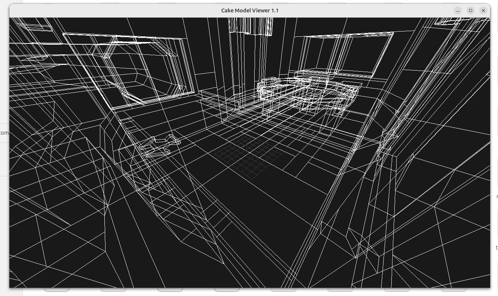

# Model viewer for Cake engine




This small app can display .md2, .bsp, .pcx and .wal files (provided as an argument).
It is part of the `cake` module and has its own LWJGL3 entrypoint.

### How to run
Run from IDE using `org.demoth.cake.lwjgl3.Lwjgl3ModelViewerLauncher.main` and pass a file path as the program argument.

### How to build
Build the Cake desktop app with `./gradlew :cake:lwjgl3:build`.

### Native build
Alternatively, you can build a native (so you have easier time to associate with the files in OS)
`./gradlew :cake:lwjgl3:nativeBuild` (requires GraalVM JDK 17)
You will find the executable in `cake/lwjgl3/build/native/nativeCompile`

## List of features
 - renders .md2 model in the 1st animation frame with the first referenced skin (searches in the same folder as the .md2 file)
 - can also render `.pcx` & `.wal` images
 - grid & axes
 - TODO: change skins
 - TODO: render animation
 - TODO: display information about opened file - like size, number of triangles, vertices, frames, etc...

## How to associate .md2 files with Cake model viewer?

### Linux instruction:

1. Create a new MIME type description file.
   Create a new file in the `~/.local/share/mime/packages` directory. 
   You can name it something like `quake-md2.xml.`:

```xml
<?xml version="1.0" encoding="UTF-8"?>
<mime-info xmlns="http://www.freedesktop.org/standards/shared-mime-info">
<mime-type type="application/x-quake-md2">
  <comment>Quake II Model</comment>
  <glob pattern="*.md2"/>
</mime-type>
</mime-info>
```

Then update database `update-mime-database ~/.local/share/mime`

2. Define the desktop entry in this file.
You can add an application file here `~/.local/share/applications/cake-md2-viewer.desktop`:

```
 [Desktop Entry]
 Version=1.0
 Name=Cake Model Viewer
 Exec=/path/to/the/executable %f
 Icon=quake
 Terminal=false
 Type=Application
 MimeType=application/x-quake-md2
```
    
Then update database `update-desktop-database ~/.local/share/applications`

3. Associate the MIME Type with Your Application


Run `xdg-mime default cake-md2-viewer.desktop application/x-quake-md2`
